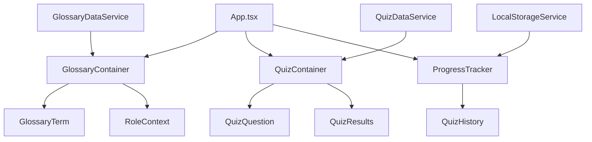

# Design Document

## Overview

The Interactive AI 101 Module is a React TypeScript single-page application that provides an educational experience through an interactive glossary and quiz system. The application is designed as a fully static site compatible with GitHub Pages, using localStorage for client-side data persistence and JSON files for content management.

The design follows a component-based architecture with clear separation of concerns between data management, UI components, and business logic. All functionality is implemented client-side to maintain compatibility with static hosting while providing a rich, interactive user experience.

## Architecture

### High-Level Architecture



### Data Flow

1. **Application Initialization**: App component loads and initializes services
2. **Data Loading**: Services fetch static JSON data and localStorage state
3. **Component Rendering**: UI components receive data through props
4. **User Interactions**: Events trigger state updates and localStorage persistence
5. **Progress Tracking**: All user actions are recorded for progress display

### Static Asset Structure

```
public/
├── index.html
├── questions.json          # Quiz question data
├── glossary.json          # Term definitions and metadata
└── assets/
    └── styles/
        └── main.css       # Global styles
```

## Components and Interfaces

### Core Components

#### App Component
- **Purpose**: Root application component and state management
- **Responsibilities**: Route management, global state, service initialization
- **Props**: None (root component)
- **State**: Current view, user progress, application settings

#### GlossaryContainer
- **Purpose**: Manages glossary display and term interactions
- **Responsibilities**: Term filtering, search functionality, role context switching
- **Props**: `terms: GlossaryTerm[]`, `selectedRole?: UserRole`
- **State**: Active term, selected role filter, search query

#### QuizContainer
- **Purpose**: Orchestrates quiz flow and question management
- **Responsibilities**: Question selection, answer validation, score calculation
- **Props**: `questions: QuizQuestion[]`, `onComplete: (results: QuizResults) => void`
- **State**: Current question index, user answers, quiz session data

#### ProgressTracker
- **Purpose**: Displays user progress and statistics
- **Responsibilities**: Quiz history, progress visualization
- **Props**: `quizHistory: QuizAttempt[]`
- **State**: Display preferences, expanded sections

### Data Interfaces

```typescript
interface GlossaryTerm {
  id: string;
  term: string;
  definition: string;
  externalLink: string;
  roleContext: {
    [key in UserRole]: string;
  };
}

interface QuizQuestion {
  id: string;
  term: string;
  question: string;
  options: string[];
  correctAnswer: string;
  glossaryLink: string;
}

interface QuizAttempt {
  timestamp: number;
  score: number;
  totalQuestions: number;
  questionsAnswered: string[];
}

interface UserProgress {
  quizAttempts: QuizAttempt[];
  answeredTerms: Set<string>;
  bestScore: number;
}

type UserRole = 'business' | 'pm-designer' | 'engineer' | 'data-scientist'; // TODO: Maybe we want marketing? 
```

### Service Layer

#### LocalStorageService
- **Purpose**: Centralized localStorage management
- **Methods**: 
  - `getProgress(): UserProgress`
  - `updateProgress(progress: Partial<UserProgress>): void`
  - `recordQuizAttempt(attempt: QuizAttempt): void`

#### QuizDataService
- **Purpose**: Quiz question management and selection logic
- **Methods**:
  - `loadQuestions(): Promise<QuizQuestion[]>`
  - `selectRandomQuestions(count: number, excludeTerms: Set<string>): QuizQuestion[]`
  - `validateAnswer(questionId: string, answer: string): boolean`

#### GlossaryDataService
- **Purpose**: Glossary data loading and management
- **Methods**:
  - `loadGlossary(): Promise<GlossaryTerm[]>`
  - `getTermById(id: string): GlossaryTerm | undefined`
  - `filterByRole(role: UserRole): GlossaryTerm[]`

## Data Models

### Static Data Structure

#### questions.json
```json
{
  "questions": [
    {
      "id": "inference-001",
      "term": "inference",
      "question": "Which term describes running a model to get predictions?",
      "options": ["Training", "Inference", "Prompt", "Token"],
      "correctAnswer": "Inference",
      "glossaryLink": "#inference"
    }
  ]
}
```

#### glossary.json
```json
{
  "terms": [
    {
      "id": "artificial-intelligence",
      "term": "Artificial Intelligence (AI)",
      "definition": "Systems that perform tasks normally requiring human intelligence.",
      "externalLink": "https://www.ibm.com/topics/artificial-intelligence",
      "roleContext": {
        "business": "Understand automation potential",
        "pm-designer": "Scope AI features",
        "engineer": "Implement AI integrations",
        "data-scientist": "Concept context"
      }
    }
  ]
}
```

### LocalStorage Schema

```typescript
interface StoredUserData {
  version: string;
  quizHistory: QuizAttempt[];
  answeredTerms: string[];
  preferences: {
    selectedRole?: UserRole;
    theme?: 'light' | 'dark';
  };
}
```

## Error Handling

### Error Categories

1. **Data Loading Errors**: Failed JSON fetch, malformed data
2. **Storage Errors**: localStorage unavailable, quota exceeded
3. **Validation Errors**: Invalid user input, corrupted state
4. **Network Errors**: Failed external link navigation

### Error Handling Strategy

#### Graceful Degradation
- **Missing JSON Data**: Display error message with retry option
- **localStorage Unavailable**: Continue without progress tracking
- **Malformed Questions**: Skip invalid questions, log warnings
- **Network Issues**: Show offline indicator, cache essential data

#### Error Boundaries
```typescript
class ErrorBoundary extends React.Component {
  // Catches JavaScript errors in component tree
  // Displays fallback UI with error reporting
  // Provides recovery options where possible
}
```

#### Validation Layer
- Input sanitization for all user data
- JSON schema validation for static data files
- Type guards for localStorage data integrity
- Fallback values for missing or corrupted data

## Testing Strategy

### Unit Testing
- **Components**: React Testing Library for component behavior
- **Services**: Jest for business logic and data management
- **Utilities**: Pure function testing with comprehensive edge cases
- **Hooks**: Custom hook testing with react-hooks-testing-library

### Integration Testing
- **Data Flow**: End-to-end user interactions
- **localStorage**: Storage persistence across sessions
- **Error Scenarios**: Network failures, corrupted data
- **Accessibility**: Screen reader compatibility, keyboard navigation

### Accessibility Testing
- **Automated**: axe-core integration for WCAG compliance
- **Manual**: Keyboard navigation, screen reader testing
- **Visual**: Color contrast validation, text scaling
- **Cognitive**: Clear navigation, consistent interactions

### Performance Testing
- **Bundle Size**: Webpack bundle analyzer for optimization
- **Load Time**: Lighthouse performance audits
- **Memory Usage**: React DevTools profiler
- **Accessibility Performance**: axe-core performance impact

### Test Data Management
- **Mock Data**: Comprehensive test fixtures for all data types
- **Edge Cases**: Empty states, maximum data scenarios
- **Error Conditions**: Network failures, malformed data
- **User Scenarios**: Different progress states, role preferences

### Continuous Integration
- **GitHub Actions**: Automated test runs on pull requests
- **Coverage Reports**: Minimum 80% code coverage requirement
- **Accessibility Gates**: Automated accessibility testing in CI
- **Performance Budgets**: Bundle size and performance thresholds